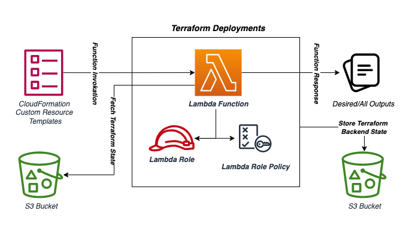

# Demicon DevOps Challenge

## Introduction

Create a Lambda function that allows to retrieve an arbitrary terraform state file from S3 and return terraform outputs from the state file

## Design Choice and Implementation

For the provisioning of the infrastrcuture, ***Terraform*** is being used for IaC (Infrastructure as Code) to setup different AWS Services inlucding:

* AWS IAM Role
* AWS IAM Policy
* AWS Lambda Function
* AWS CloudWatch Log Group
* AWS IAM Role Policy Attachement

## Architecture Flow Diagram



## Project Structure

This project comprises 4 main folders (below are the details):

- `cloudformation-samples` contains cfn custom resource example templates in both `Yaml` and `Json` formates
    
- `infrastructure` contains terraform scripts to deploy the infrastructure

- `scripts` contains utility scripts

- `src` contains lambda function source code (python)

## Project Setup

***Note***: I'm using MacOS

1. Install [Homebrew](https://brew.sh/)

2. Install aws cli v2: `brew install awscli`

3. Install terraform: `brew tap hashicorp/tap` and `brew install hashicorp/tap/terraform`

4. Configure aws credentials using `aws configure`

5. Set profile (region & output) in `~/.aws/credentials/config`

7. Run the following script to create the bucket for storing terraform backend state

   * `chmod +x ./scripts/create-s3.sh && ./scripts/create-s3.sh ddc-terraform-backend-state`

8. Lint the src for bugs and quality checker using pylint as

   * `pip3 install pylint && pylint -rn src/*.py || true`

9. Create the payload for lambda function

   * `cd src && zip -r ./payload.zip . -x ".*" -x "__MACOSX" && cd ..`

10. Update terraform scripts for infrastructure deployment

- Update `infrastructure/backend.tf` file with bucket name, key and region value

   ```json
   backend "s3" {
      bucket = "BUCKET_NAME" //ddc-terraform-backend-state
      key    = "BUCKET_KEY" // ddc/terraform/backend/state
      region = "AWS_REGION" // us-east-1
   }
   ```

- Update `infrastructure/terraform.tfvars` file with region and arbitrary terraform state files bucket name (assumption: the bucket should already exist with terraform state files)

   ***Note***: `sample_state_file.tfstate` is in root folder director which can be used as a sample input 

   ```json
   aws_region = "AWS_REGION" // us-east-1
   arbitrary_terraform_state_files_bucket = "BUCKET_NAME" // ddc-arbitrary-terraform-state-files
   ```

## Infrastructure Deployment

Run following commands to create Infrastructure using terraform 

- Change directory to infrastructure

   `cd infrastructure`

- Initialize the terraform with plugin and provider: 

   `terraform init`

- To validate the infrastructure code for any error:

   `terraform validate`

- To confirm what resources are going to be added in the infrastructure:

   `terraform plan`

- To apply the infrastructure changes:
   
   `terraform apply`

## Invokation

The CloudFormation Custom Resource will invoke Lambda Function and use the return value(s) as input(s) for other CloudFormation Resources

> Go to AWS CloudFormation console and create new stack using `yaml` or `json` templates of your own choice present in `cloudformation-samples/` directory. Provide ***Stack Name*** and other parameters as:

- ***LambdaArn***:
  Custom Resource will invoke this lambda function to get terraform outputs as return values
  
- ***BucketName***:
  S3 bucket name where arbitrary terraform state files are stored
  
- ***BucketKey***:
  Name of a terraform state file key stored in arbitrary S3 bucket

- ***DesiredOutput***:
  Name of specific output to get from terraform state file. By default all outputs of state file will be returned by the lambda function
  
## Cleanup (Deletion)

1. To cleanup, simply first delete the CloudFormation stacks from the AWS Console which were deployed earlier for the invokation

2. To tear down the infrastructure, run the following command while being in the ***infrastructure*** directory

   `terraform destroy`

